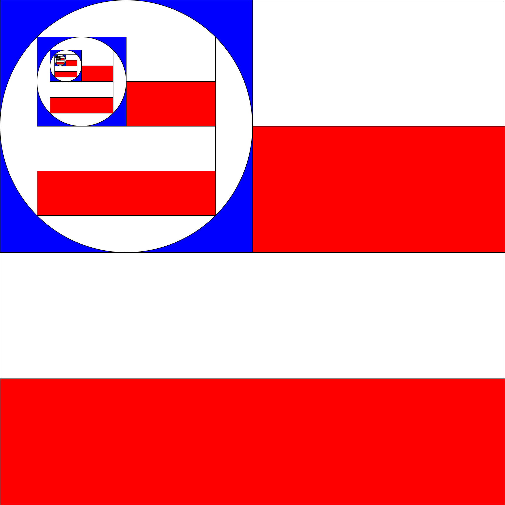

# Fractal dimensions in Esporte Clube Bahia's crest

"Under the slogan of 'Born to Win', Esporte Clube Bahia emerged in 1931. 
Historically, it was Raimundo Magalhães who created the tricolor badge in the late 1930s." 
Marcio Luis F. Nascimento, in \href{}{On why Bahia's crest is unique}.[Correio 24h](https://www.correio24horas.com.br/noticia/nid/marcio-luis-f-nascimento-por-que-o-escudo-do-bahia-e-unico/)
In its self-similar pattern, squares and circles are alternately inscribed in each other.
The design starts with an inner square presenting red horizontal stripes. 
This square is inscribed in a circle, which is also inscribed in an intermediate blue square. 
These 3 shapes compose the left upper quarter in a new red striped square, forming the loop.  

